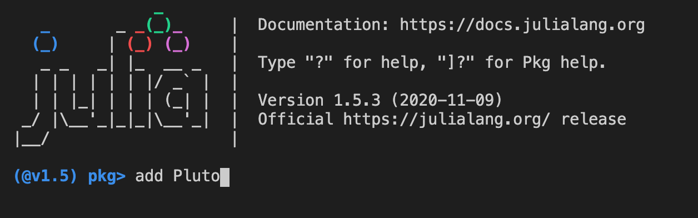
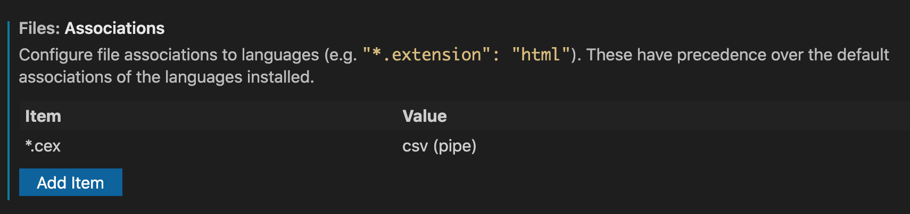

# Technical prerequisites

We need three kinds of software.

1. a version control system
2. a text editor
3. a programming environment for running our custom validation and verification software

## Software to install

1. Version control: install git, and create an account on github
2. Text editor: download and install [Visual Studio Code](https://code.visualstudio.com/download) (VS Code) for your system
3. Programming environment:  download and install [the julia language](https://julialang.org/downloads/) for your operating system.  The first time you run `julia`, you'll want to add the Pluto notebook system. Type a right bracket `]`, and you'll be in "package management mode".  As illustrated here, at the `pkg>` prompt, type `add Pluto`.  When that completes installing, just backspace or delete to return to the `julia` prompt (which you can always exit by typing `exit()`).

## Configuring VS Code

(Details TBA.)

Summary:

- install the "Scholarly xml" extension
- install the "Live Share" extension.  The first time you use this, you'll have to go through a complicated song and dance for one-time authentication.  (Don't fall for temptation to try to share a session with yourself; wait until you can test this with someone on your team.)
- install the "Rainbow CSV" extension.
    - configure the file extension `*.cex` to use `csv (pipe)`
    
