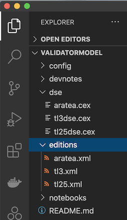
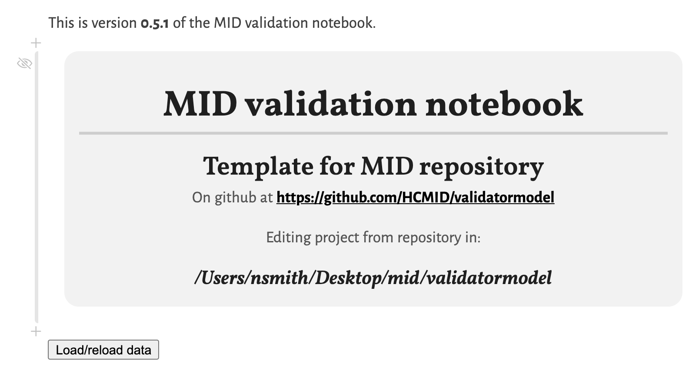
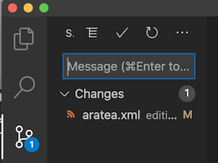
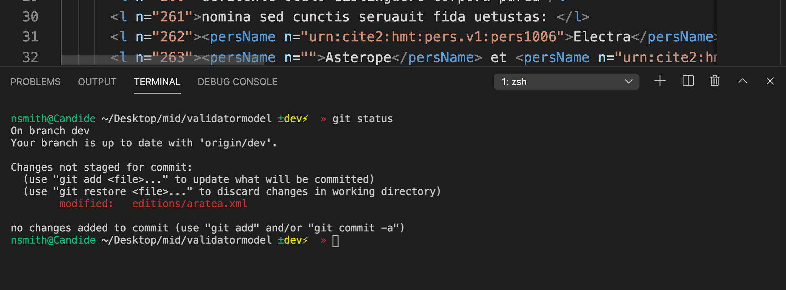

> *This section needs to be updated as we gain experience with our new software stack.*
> *What tips and tricks are you discovering?*

# Regular workflow for an MID project

## Starting up a work session

Before you do anything else, [start your validation notebook](./opennb/).  While this is starting up, get the rest of your project organized.

Your team will want to have your text editor, VS Code, open, and a web browser with two tabs or windows open:

1. the image citation tool where you can pan and zoom images of the text you're editing
2. the validation notebook

One member of your team will be the *host* for the session.  The host manages pulling and pushing to your project's github.  The host can use VS Code's `Live Share` extension to invite the rest of the team so everyone can edit simultaneously on the documents.  (Note that only the host will be able to commit and push to github.)

If your team is working over Zoom, a second member of the team should share a window with the image citation tool, so everyone can focus on the same part of the image.  Use Zoom annotations to draw on the shared window when that's helpful to point things out.

## Work flow

You'll normally be working on XML editions and indexing your edited text in DSE tables, which you'll manage from the `editions` and `dse` folders.

Your team should work through these in parallel:  don't let your XML get way ahead of your DSE indexing, or vice versa.

When you've edited a chunk, check it out in your validation notebook.  The top of your notebook should look something like this.  (The name of your project, and possibly the version of the notebook will be different.)

Use the `Load/reload data` button to reload your repository.

## VS Code tips and tricks

### Managing your `git` repository

The session host can manage git *either* using VS Code's built in *or* the command line from a terminal.

The user interface to git in VS Code is illustrated here.  This may be easy enough to teach to newcomers?

You can also open a terminal directly in VS Code.  Some people may find it easier to open a terminal right in VS Code and quickly enter a `git` command.  Note that we no longer need to work with a separate terminal in order to manage our version control.

### Others

- Short cuts?
- Best practices?
- Other ideas or suggestions?