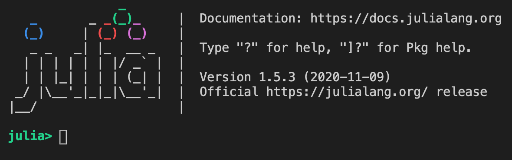
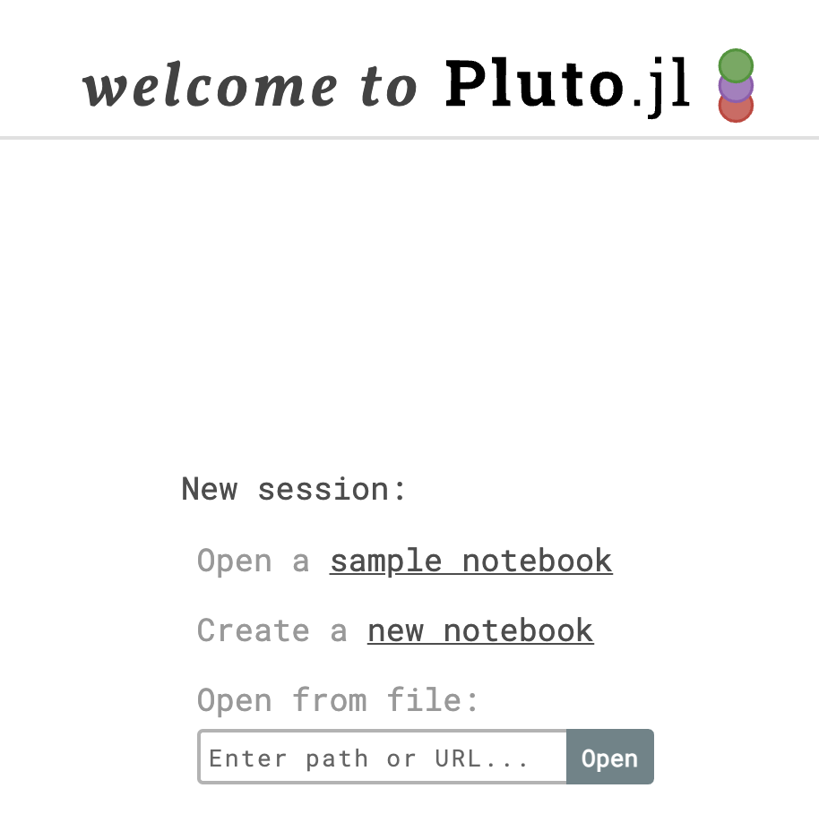

# Start your validation notebook

Start your basic validation notebook before beginning to edit.

First, start `julia`. (If you're using VS Code, you can use the Terminal menu to open a new terminal in VS Code, and type `julia`.  Depending on your operating system, you may have an icon on your Desktop or in your Applications folder that you can use to open `julia`) This will give you a `julia` prompt, that should look something like this:




Enter these two commands:

```julia
using Pluto
Pluto.run()
```

This will start a Pluto notebook server, and open a window in your default browser that looks like this:





Enter the path to the file in your `notebooks` directory named `midvalidator-VERSION.jl`.

(If your project has additional notebooks to validate project-specific tests, you can open them as well in a separate browser tab.)

To minimize the setup you have to do, the notebook is configured to download and build the entire app each time you start it. This means you don't need to have anything else preinstalled, but it also means that startup time is slow. (It can take up to 2 minutes on an older laptop.) Once the notebook has started, it is very responsive even on older personal machines.

